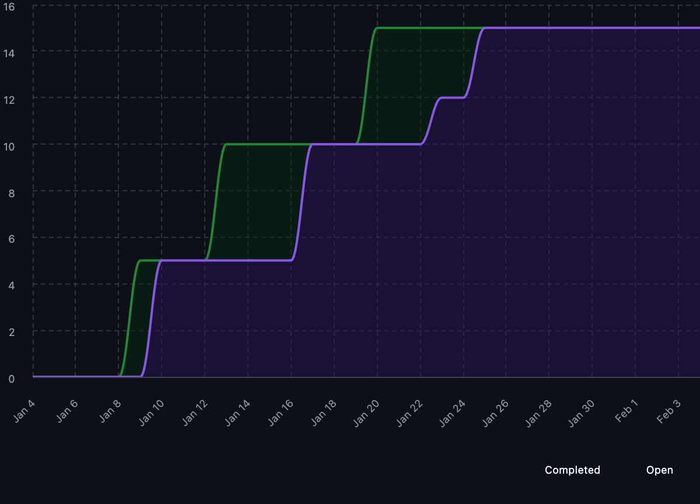
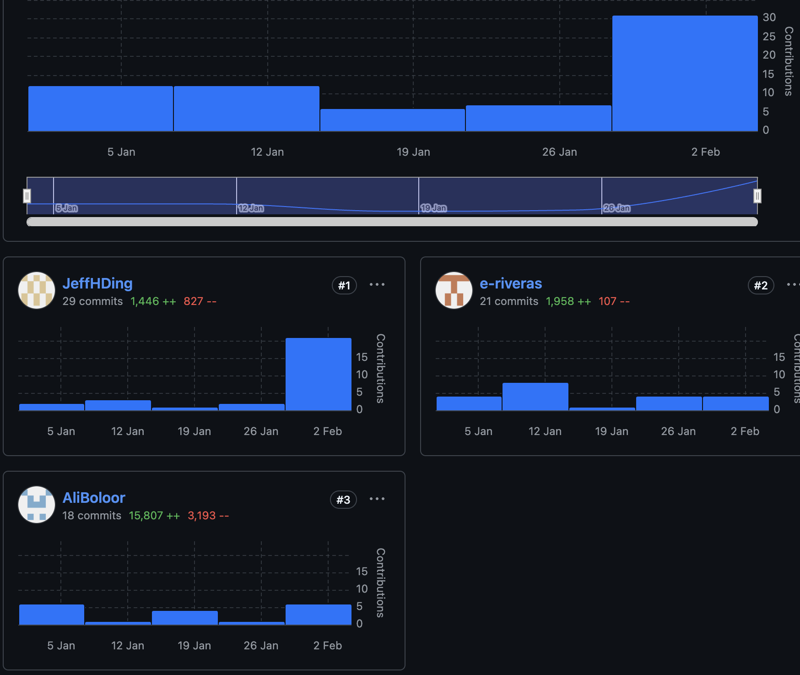

## Issue Assignment, Milestones, and Project Boards

The management of this project relied heavily on collaborative brainstorming and GitHub's tracking features:

- **Issues & Communication:** Features were first brainstormed collaboratively by the team. Any bugs discovered during development were immediately communicated via GitHub Issues or Slack, and often addressed in person to ensure quick resolution.
- **Project Boards:** We utilized GitHub Project Boards to track the status of these brainstormed features, moving them through the pipeline as team members picked up tasks.
- **Milestones:** Work was grouped into milestones to track deliverables. As noted in our velocity analysis, the workload was lighter in early milestones (1 and 2) and ramped up significantly in milestones 3 and 4 as features were deployed and refined.

**Reflection:**
The combination of Slack for immediate alerts and GitHub Issues for tracking proved effective. However, as we dispersed to work independently, gaps in communication regarding dependencies became apparent, which we address in the "Improvements" section below.

---

## Analytical Project Board Views & Data-Driven Retrospective
We utilized project metrics to analyze our efficiency and contribution equity.

### Velocity: How did our scope change over time?

**Analysis:**
Work was noticeably lighter in Milestones 1 and 2, serving as a setup phase. Velocity began to ramp up in Milestone 3 and culminated in a significant leap in workload during Milestone 4. This surge was driven by the need to address missing badges, finalize documentation, and drastically improve test coverage based on feedback and errors that arose once features were fully fleshed out. Average time to close all issues was approximately 4-5 days, which was manageable given our team size and workload.

---

### Burn-up Chart: Project Completion Rate

**Analysis:**
The burn-up chart reflects the "backend-heavy" nature of our workflow. The early milestones show a steady but slow completion rate. The sharp rise in the final milestone corresponds to the aggregation of peer feedback and the resolution of the "last mile" tasks—specifically the integration of unit tests and repository badges which were critical for the final release.

---

### Team Contributions: Distribution of Labor

**Analysis:**
- **Ali Boloor:** [18] commits
- **Jeffrey Ding:** [29] commits
- **Eduardo Rivera:** [21] commits

While work was dispersed to allow members to code features independently, we aimed for an equitable distribution. The independent nature of the work, however, did lead to some integration challenges (detailed below) which required collective effort to resolve.
There were varying commit counts among team member; however, this is due to varying task complexity. All members contributed significantly to the final product. Teammates all collaborated effectively to resolve outstanding github issues.
---

## Development Tools, Infrastructure, and Organizational Practices

- **Tech Stack:** We used **Python** for the core codebase and **Quartodocs** to publish our documentation.
- **Communication:** **Slack** and **GitHub Issues** were our primary channels. Real-time debugging often happened in person.
- **AI Integration:** **LLMs** were utilized throughout the project to assist in the construction of unit tests, code checking, and formatting, speeding up the development of boilerplate code.
- **Dependency Management:** We faced challenges setting up dependencies in `pyproject.toml` due to extraneous imports in unit tests and source scripts (specifically `plotly` and `visualize_dir.py`).

**Scaling Up Recommendations:**
For larger-scale versions of this project, we would:
- Formalize the "feature mapping" phase to include a required package list before coding begins.
- Implement stricter CI checks earlier to catch extraneous imports before the final milestone.

---

## DAKI Retrospective

| **Drop** | **Add** |
| :--- | :--- |
| *What was inefficient?* | *What should we start doing?* |
| - Adding dependencies ad-hoc without notifying the team. | - Early mapping of features to required packages. |
| - Leaving badge/coverage configuration for the final sprint. | - Communicating new library additions immediately via Issues/Slack. |

| **Keep** | **Improve** |
| :--- | :--- |
| *What worked well?* | *What needs refinement?* |
| - Collaborative brainstorming sessions for feature generation. | - Communication gaps when dispersing to work independently. |
| - Using LLMs for test generation and formatting. | - Management of `pyproject.toml` dependencies to avoid conflict with tests. |

---

## Final Reflections

- **Successes:** Our two greatest achievements were, first, successfully developing the features that addressed the issues we brainstormed at the start, and second, effectively aggregating and implementing all the feedback acquired from our peers.
- **Improvements:** We struggled with `pyproject.toml` dependencies due to extraneous imports (e.g., `plotly` in `visualize_dir.py`). This was a result of communication gaps during independent work. In the future, we would map required packages early and communicate additions immediately.
- **Teamwork:** We worked well in person to address bugs, but the independent coding phase requires better synchronization on infrastructure changes.

---
*Prepared by Group 16, Tame your Files, 2026-02-03*